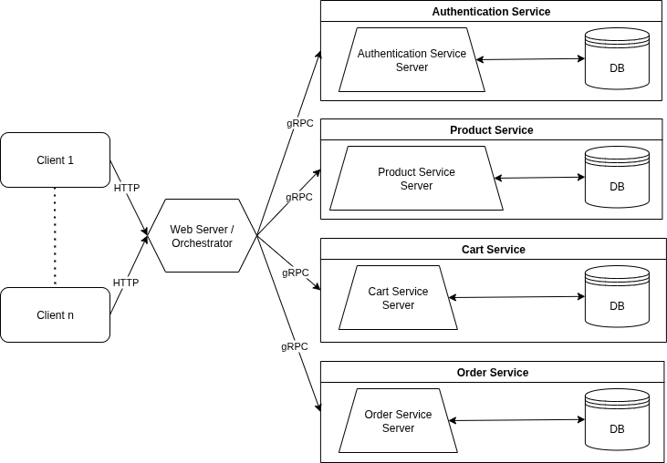

# dp-ecommerce-project
Project for the Master Course in Distributed Programming for Web, IoT and Mobile Systems

@Unifi MS Software: Science and Technology.

# The project
This repository contains an implementation of an ecommerce (online clothing store), in which clients can choose and buy clothes.  
There are two types of users:
- client: user which can 
    - read the catalogue of products;
    - add products to the shopping cart;
    - buy products placing orders;
    - see the list and details of all its orders;
    - modify the number and removing products in the shopping carts;
    - cancel an order (if not already canceled or delivered);
    - change its password and other profile information.
- administrator: user which acts both as an admin and as a client:
    - admin functions:
        - see the list of registered users;
        - change the role of the other users (from client to admin nd viceversa);
        - see the list of all the orders;
        - see details of each order;
        - modify the status of orders (processing -> shipped -> delivered) but cannot cancel orders of other users;
    - client functions:
        - the same of a normal client: in this way, an administrator can use its account to purchase clothes on the ecommerce.

## Default Users and Products
When starting the ecommerce, default users and products are generated. With respect to the users, two default users are created:
- an administrator:
    - username: admin
    - password: admin123
- a client:
    - username: demo-client
    - password: demo123

## How to use the ecommerce
- Register -> through the `register` button in the top right
- Login -> through the `login` button in the top right using one of the default user, or another one that you have registered.
- Enjoy the shopping, thanks to the user-friendly interface.

## Some details about the architecture
This project aims to consolidate knowledge related to microservice architectures and web applications.  
Webclients communicate with the `Web Server`, and subsequently with all the microservices, sending HTTP requests through links and buttons in the UI.  
The webserver has its set of predefined HTTP routes which perform bind to handler functions, which in turn use the `Orchestrator` to map each HTTP request to the corresponding gRPC client. Each gRPC client gets the connection to the corresponding gRPC server from the `Service Manager`, which periodically (every 15 seconds) closes all the connections to gRPC servers and restores them, in order to ensure reliability of all the gRPC connections.  
Thanks to docker-compose and to gRPC health-checks, if one of the servers fails, it is timely restarted allowing the service manager for a connection restoration. In this way, the ecommerce website is always up.  


# Prerequisite
- docker
- docker-compose
- make

# Run the project
Form folder's root:
- `make build`
    - builds containers and compile protobuf files
- `make up` (or `make up_bg` to run the ecommerce in background)
    - to start all components
- `make stop`
    - to stop all docker container
- `make down`
    - to stop containers and to remove docker volumes and networks from the system

_Folder structure_
```plaintext
dp-ecommerce-project/  
|  
├── deploy/ # *.yml files for docker compose and .env file
|
├── ecommerce
|   ├── auth-service/ # module authentication microservice
|   ├── cart-service/ # module cart microservice
|   ├── order-service/ # module order microservice
|   ├── product-service/ # module product microservice
|   ├── orchestrator/ # module orchestrator (grpc clients, orchestrator, service manager, HTTP web server, ...)
|   ├── logger/ # module logger (custom logger implementation)
|   └── proto/ # *.proto files
|
├── Makefile
└── README.md
```